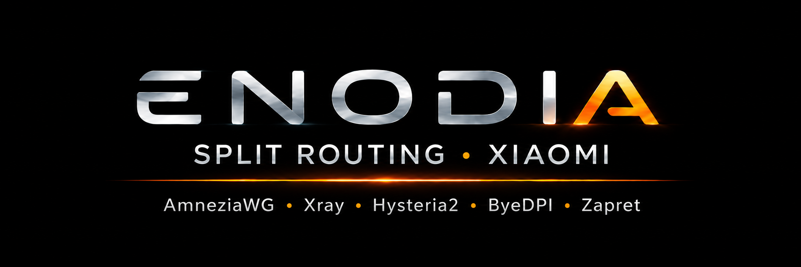

### [Русский](README.md) | English

Enodia is an open-source project for Xiaomi routers on stock firmware. Blocked sites go through your
VPN server or open without a server, all other traffic goes direct. Everything is configured in a web
panel on the router itself.

### [Download](https://github.com/Axel173/xiaomi-be7000-amnezia/releases) | [Telegram](https://t.me/+tfMLMVKG03FhMGYy) | [Support the author](#donate)

## Features

- Installation from a computer: the wizard opens SSH on the router and installs the panel, the rest
  is done in the browser.
- Split routing by domains, subnets, geo categories and rule groups, separately for devices and
  Wi-Fi networks.
- Several VPN protocols and up to three additional exits through other servers.
- Bypassing blocks without your own server: ByeDPI and Zapret.
- Home access: the router works as an AmneziaWG server, a phone connects with a QR code.
- Encrypted DNS (DoH/DoT), ad blocking, panel login with two-factor authentication.
- Watchdog: restarts the tunnel, switches to a backup server, emails you about failures.
- Updates from the panel as a signed package from GitHub.
- Protocols or the whole system can live on a USB stick.
- The panel is in Russian and English, with light and dark themes.

## Routers

The project has been run and worked on Xiaomi BE3600, BE6500, BE7000, BE10000, BE10000 PRO and AX3600
routers with stock firmware. The setup wizard opens root SSH access by itself with the built-in
[xmir-patcher](https://github.com/Axel173/xmir-patcher).

## Protocols

## Installation

1. Download `enodia-setup-<version>.zip` from the
   [Releases](https://github.com/Axel173/xiaomi-be7000-amnezia/releases) page and unpack it.
2. Run `enodia-setup.bat` (Windows), `enodia-setup.command` (macOS) or `./enodia-setup.sh` (Linux).
3. Go through the setup wizard in the browser.
4. Open the panel: `http://192.168.31.1:8088` (your router's IP, port 8088).

No need to install Python: if it's missing, the launcher downloads it. Detailed documentation is in
progress; questions go to [Telegram](https://t.me/+tfMLMVKG03FhMGYy).

## Projects used

- [AmneziaWG](https://github.com/amnezia-vpn/amneziawg-go)
- [Xray-core](https://github.com/XTLS/Xray-core)
- [Hysteria](https://github.com/apernet/hysteria)
- [ByeDPI](https://github.com/hufrea/byedpi)
- [zapret](https://github.com/bol-van/zapret)
- [hev-socks5-tunnel](https://github.com/heiher/hev-socks5-tunnel)
- [https_dns_proxy](https://github.com/aarond10/https_dns_proxy)
- [xmir-patcher](https://github.com/openwrt-xiaomi/xmir-patcher)
- [amneziawg-be7000](https://github.com/alexandershalin/amneziawg-be7000) — AmneziaWG installation script (`awg_setup.sh`)
- lists: [opencck / iplist](https://iplist.opencck.org) (based on [rekryt/iplist](https://github.com/rekryt/iplist)),
  [ITDog allow-domains](https://github.com/itdoginfo/allow-domains)

Thanks to the [@xiaomi_be7000](https://t.me/xiaomi_be7000) community for their experience with these routers.

## Support the author

<!-- IMAGE #7 (awaiting the file): docs/img/banner-support.png — "Support the author" section BANNER: warm thanks, a cup next to the router.
Once the file is in place, replace this whole comment with:

-->

The project is **free and open-source**, and there's a lot of manual work behind it: debugging on
live hardware, maintaining the lists and scripts, documentation.

If it saved you **time and nerves** or was simply useful — here's how to say thanks:

**One-time or recurring donation via Telegram:**
- 💬 **Telegram (Tribute)** — [web.tribute.tg/d/LtA](https://web.tribute.tg/d/LtA) (by card)
- 💎 **Telegram (Tribute, crypto)** — [t.me/tribute](https://t.me/tribute/app?startapp=dLtA) (crypto, right inside Telegram)

**With cryptocurrency** (several networks to choose from — the donor picks the convenient one):
<!-- One address per network, the network's tokens share it:
       ETH + USDT-ERC20      → one Ethereum address (0x…)
       TRX + USDT-TRC20      → one TRON address (T…)
       Toncoin + USDT-TON    → one TON address (UQ…)
     Cheap for the donor: TON and USDT-TON (~a cent), SOL (fractions of a cent), TRX. Pricier: BTC, ETH, USDT-ERC20. Addresses verified by checksum. -->
- ₿ **Bitcoin (BTC)** — `bc1q5wdv30gdnsc95dkju6zkenjjcsnfs0z77wxhsh`
- Ξ **Ethereum (ETH)** — `0x6558410D16A2937c7B7eF7E447013ddEadf11e4e`
- ₮ **USDT** — **TON** network — `UQDkGR4JuzMN1cUg_5ehYf5RFRSbvs7ynjeOdPCyC72F8r3a`
- ₮ **USDT** — **TRC-20** (TRON) network — `TKPAFNRJUx6zcYTeCrAEBjFoWhuPUDyBG8`
- ₮ **USDT** — **ERC-20** (Ethereum) network — `0x6558410D16A2937c7B7eF7E447013ddEadf11e4e`
- 💎 **Toncoin (TON)** — `UQDkGR4JuzMN1cUg_5ehYf5RFRSbvs7ynjeOdPCyC72F8r3a`
- 🔺 **TRON (TRX)** — `TKPAFNRJUx6zcYTeCrAEBjFoWhuPUDyBG8`
- ◎ **Solana (SOL)** — `Eq48vnUcJn8yxmAtmyZJ4wmGW3TJaMhRdZkRJi1VULYx`

**Getting a VPS for the project? Use a referral link:**
you need a server anyway (see [Protocols](#protocols)) — if you sign up through a
link below, the author gets a small bonus, **and the price stays the same for you** (with VDSina — even at a discount).
- 🖥️ **[MegaHost](https://megahost.kz/?from=16375)** (referral link) — VPS and hosting in Kazakhstan (own data centers, a registrar since 2009)
- 🖥️ **[JustHost](https://justhost.asia/?ref=232764)** (referral link) — VPS in many locations worldwide (you can pick the server's country)
- 🖥️ **[VDSina](https://www.vdsina.com/?partner=x8rv7m67wj)** (referral link) — affordable VPS with hourly billing; this link gives **you a 10% discount**. _(No discount but a bigger bonus to the author — [alternative link](https://www.vdsina.com/?partner=7i8wuiy8x5).)_

Thank you!
