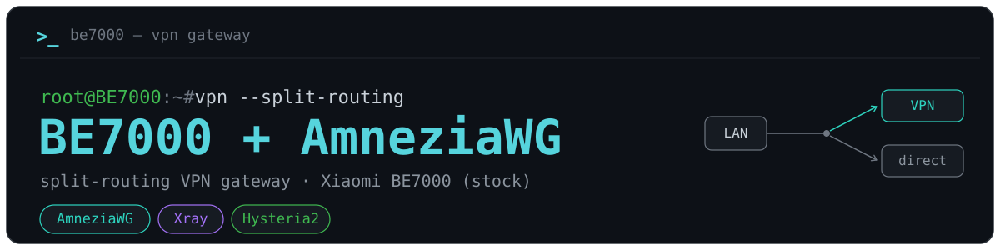

### VPN-шлюз с раздельной маршрутизацией для роутеров Xiaomi

🇷🇺 **Русский** · 🌐 [English version](README.en.md)

<!-- КАРТИНКА №1 (ждёт файла): docs/img/banner-hero.png — БАННЕР-обложка: дом, роутер и два пути трафика.
Файл положили — замените весь этот комментарий строкой:

-->

Проект превращает роутер Xiaomi на стоковой прошивке в VPN-шлюз с **раздельной маршрутизацией**:
выбранные сайты и сервисы идут через ваш сервер, всё остальное — напрямую, без лишнего крюка и
потери скорости. Правила действуют сразу на все устройства дома — VPN-приложения на каждом не нужны.

> 💛 **Проект бесплатный.** Если он вас выручит — можно [поддержать автора](#donate).

## Что умеет

- **Веб-панель на самом роутере** — всё управление в браузере, с телефона или компьютера; русский и
  английский, светлая и тёмная тема.
- **Несколько протоколов и выходов** — протокол меняется одним переключателем, а до трёх
  дополнительных выходов ведут отдельные сайты через другой сервер или протокол.
- **Обход блокировок без своего сервера** — встроенный десинк ByeDPI и Zapret.
- **Гибкие правила** — домены, подсети, группы, гео-категории стран и сервисов, отдельные устройства
  и Wi-Fi-сети; блокировка рекламы и вредоносных адресов.
- **Доступ домой** — роутер сам становится сервером AmneziaWG: телефон из любой сети подключается к
  дому по QR-коду.
- **Шифрованный DNS (DoH/DoT) и вход в панель со вторым фактором** — по желанию.
- **Сам следит за связью** — переподнимает туннель, переходит на запасной сервер, а в крайнем случае
  пускает трафик напрямую, чтобы интернет не пропал; после перезагрузки всё поднимается само, о
  сбоях приходит письмо.
- **USB-накопитель** — по желанию: тяжёлые протоколы или вся система переезжают на флешку.
- **Обновления из панели** — подписанным пакетом с GitHub.

## Роутеры

Проект запускался и работал на роутерах Xiaomi:

**BE3600 · BE6500 · BE7000 · BE10000 · BE10000 PRO · AX3600**

Нужна стоковая прошивка и root-доступ по SSH — мастер установки откроет его сам встроенным
[xmir-patcher](https://github.com/Axel173/xmir-patcher).

## Протоколы

| Протокол | Что это | Свой сервер |
|---|---|---|
| **AmneziaWG** | WireGuard с маскировкой трафика; конфиг из AmneziaVPN — файлом или ссылкой `vpn://` | нужен |
| **Xray** | VLESS (в том числе Reality), VMess, Trojan, Shadowsocks — ссылкой или подпиской | нужен |
| **Hysteria2** | быстрый протокол поверх QUIC — ссылкой `hy2://` | нужен |
| **ByeDPI** | десинк: локальный прокси сбивает DPI провайдера | не нужен |
| **Zapret** | десинк на уровне пакетов (nfqws) | не нужен |

Протоколы ставятся из панели по выбору; несколько могут стоять рядом и работать одновременно —
основным и на дополнительных выходах.

## Быстрый старт

1. Скачайте `enodia-setup-<версия>.zip` со страницы
   [Releases](https://github.com/Axel173/xiaomi-be7000-amnezia/releases) и распакуйте.
2. Запустите лаунчер: Windows — `enodia-setup.bat`, macOS — `enodia-setup.command`, Linux —
   `./enodia-setup.sh`.
3. В браузере откроется мастер установки: он спросит адрес роутера, при необходимости откроет SSH,
   поставит панель и попросит придумать к ней пароль.
4. Откройте панель — `http://192.168.31.1:8088` (адрес вашего роутера и порт 8088) — и добавьте
   сервер или включите десинк.

Компьютер — Windows, macOS или Linux; Python ставить не нужно, лаунчер скачает всё сам.

Подробная документация готовится. Вопросы и новости — в [Telegram-канале](https://t.me/+tfMLMVKG03FhMGYy).

## Благодарности

- [Amnezia](https://github.com/amnezia-vpn) — AmneziaWG и `amneziawg-go`.
- [alexandershalin/amneziawg-be7000](https://github.com/alexandershalin/amneziawg-be7000) —
  `awg_setup.sh`, установка AmneziaWG на BE7000 (вендорится в этот репозиторий).
- [Xray-core](https://github.com/XTLS/Xray-core) · [Hysteria](https://github.com/apernet/hysteria) ·
  [ByeDPI](https://github.com/hufrea/byedpi) · [zapret](https://github.com/bol-van/zapret) ·
  [hev-socks5-tunnel](https://github.com/heiher/hev-socks5-tunnel) ·
  [https_dns_proxy](https://github.com/aarond10/https_dns_proxy) — протоколы и DNS, которые ставятся на роутер.
- [opencck / iplist](https://iplist.opencck.org) (на базе [rekryt/iplist](https://github.com/rekryt/iplist))
  — CIDR-списки сервисов.
- [ITDog — allow-domains](https://github.com/itdoginfo/allow-domains) — списки доменов.
- [xmir-patcher](https://github.com/openwrt-xiaomi/xmir-patcher) — root-SSH на стоковой прошивке Xiaomi.
- Сообщество [@xiaomi_be7000](https://t.me/xiaomi_be7000) — опыт по этим роутерам.

## Поддержать автора

<!-- КАРТИНКА №7 (ждёт файла): docs/img/banner-support.png — БАННЕР раздела «Поддержать автора»: тёплая благодарность, чашка у роутера.
Файл положили — замените весь этот комментарий строкой:

-->

Проект **бесплатный и с открытым кодом**, и за ним стоит много ручной работы: отладка на живом
железе, поддержка списков и скриптов, документация.

Если он сэкономил вам **время и нервы** или просто оказался полезным — можно сказать спасибо:

**Разовый донат или периодичный через Telegram:**
- 💬 **Telegram (Tribute)** — [web.tribute.tg/d/LtA](https://web.tribute.tg/d/LtA) (картой)
- 💎 **Telegram (Tribute, крипта)** — [t.me/tribute](https://t.me/tribute/app?startapp=dLtA) (можно криптой, прямо в Telegram)

**Криптовалютой** (несколько сетей на выбор — донор берёт удобную):
<!-- Один адрес на сеть, токены сети делят его:
       ETH + USDT-ERC20      → один Ethereum-адрес (0x…)
       TRX + USDT-TRC20      → один TRON-адрес (T…)
       Toncoin + USDT-TON    → один TON-адрес (UQ…)
     Дёшево донору: TON и USDT-TON (~цент), SOL (доли цента), TRX. Дороже: BTC, ETH, USDT-ERC20. Адреса проверены по контрольным суммам. -->
- ₿ **Bitcoin (BTC)** — `bc1q5wdv30gdnsc95dkju6zkenjjcsnfs0z77wxhsh`
- Ξ **Ethereum (ETH)** — `0x6558410D16A2937c7B7eF7E447013ddEadf11e4e`
- ₮ **USDT** — сеть **TON** — `UQDkGR4JuzMN1cUg_5ehYf5RFRSbvs7ynjeOdPCyC72F8r3a`
- ₮ **USDT** — сеть **TRC-20** (TRON) — `TKPAFNRJUx6zcYTeCrAEBjFoWhuPUDyBG8`
- ₮ **USDT** — сеть **ERC-20** (Ethereum) — `0x6558410D16A2937c7B7eF7E447013ddEadf11e4e`
- 💎 **Toncoin (TON)** — `UQDkGR4JuzMN1cUg_5ehYf5RFRSbvs7ynjeOdPCyC72F8r3a`
- 🔺 **TRON (TRX)** — `TKPAFNRJUx6zcYTeCrAEBjFoWhuPUDyBG8`
- ◎ **Solana (SOL)** — `Eq48vnUcJn8yxmAtmyZJ4wmGW3TJaMhRdZkRJi1VULYx`

**Берёте VPS для проекта? Возьмите по реферальной ссылке:**
вам всё равно нужен сервер (см. [Протоколы](#protocols)) — если оформите по ссылке ниже,
автору начислится небольшой бонус, **а для вас цена та же** (а по VDSina — даже со скидкой).
- 🖥️ **[MegaHost](https://megahost.kz/?from=16375)** (реферальная ссылка) — VPS и хостинг в Казахстане (свои дата-центры, регистратор с 2009 г.)
- 🖥️ **[JustHost](https://justhost.asia/?ref=232764)** (реферальная ссылка) — VPS во множестве локаций по миру (можно выбрать страну сервера)
- 🖥️ **[VDSina](https://www.vdsina.com/?partner=x8rv7m67wj)** (реферальная ссылка) — недорогие VPS с почасовой оплатой; по этой ссылке **вам скидка 10%**. _(Без скидки, но с бо́льшим бонусом автору — [альтернативная ссылка](https://www.vdsina.com/?partner=7i8wuiy8x5).)_

Спасибо!
